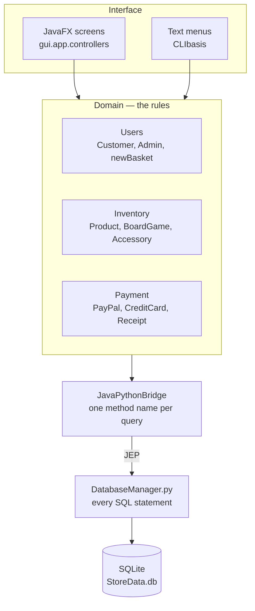
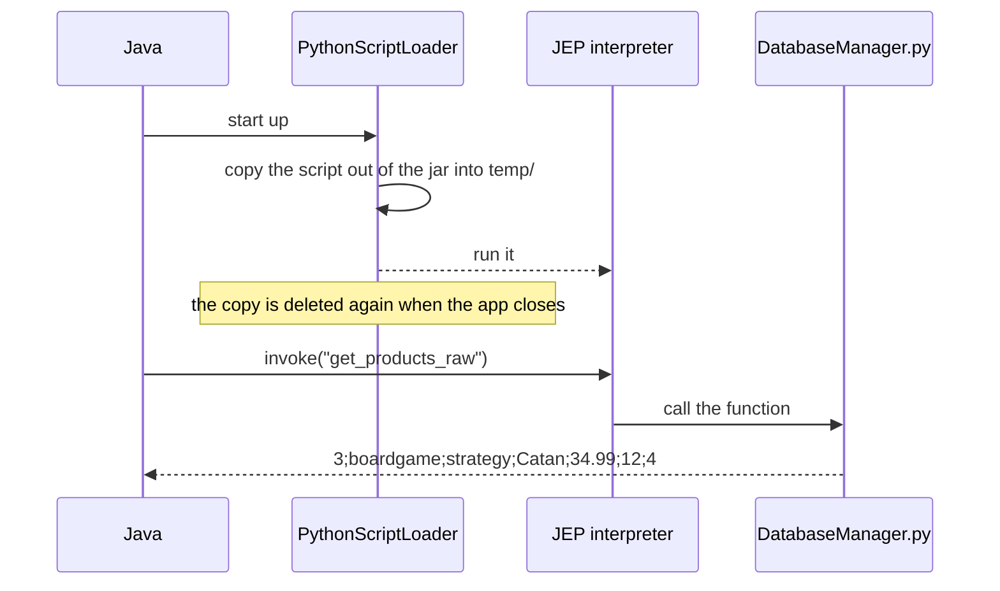
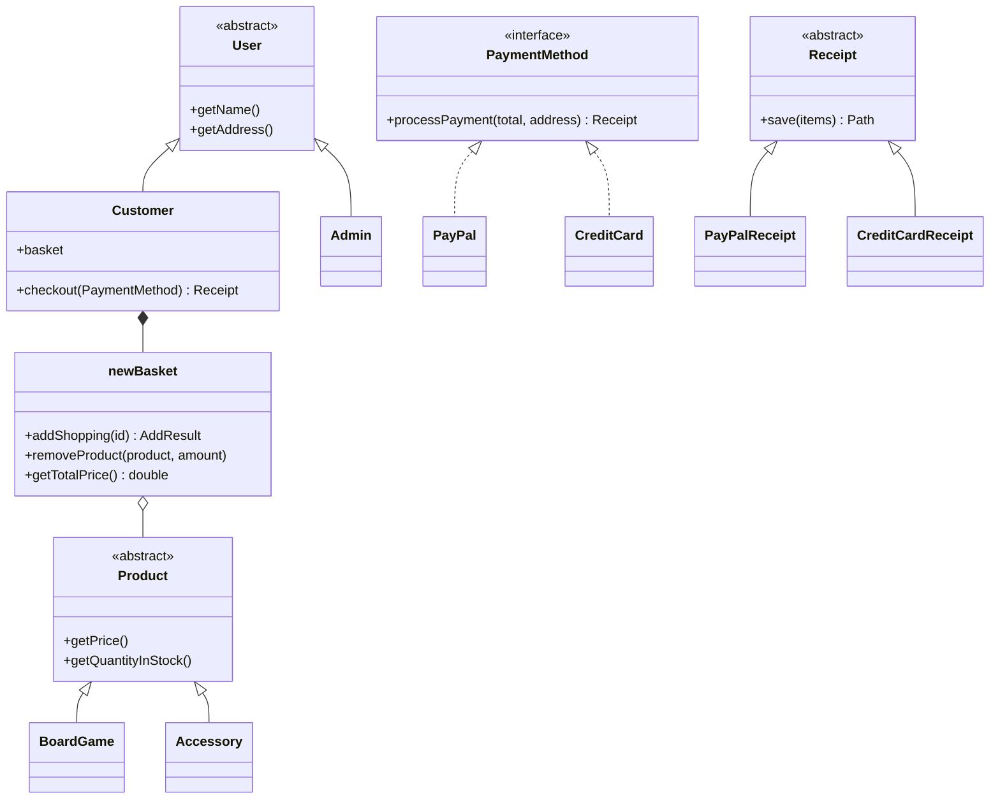
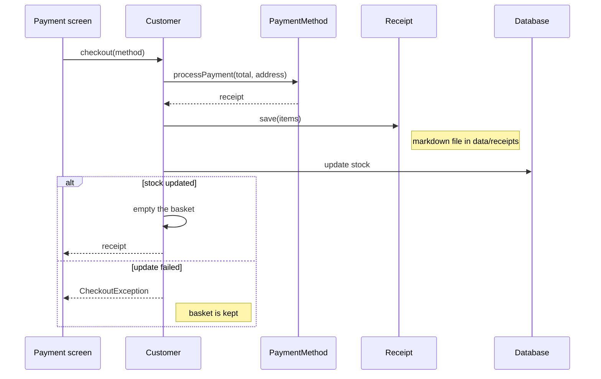
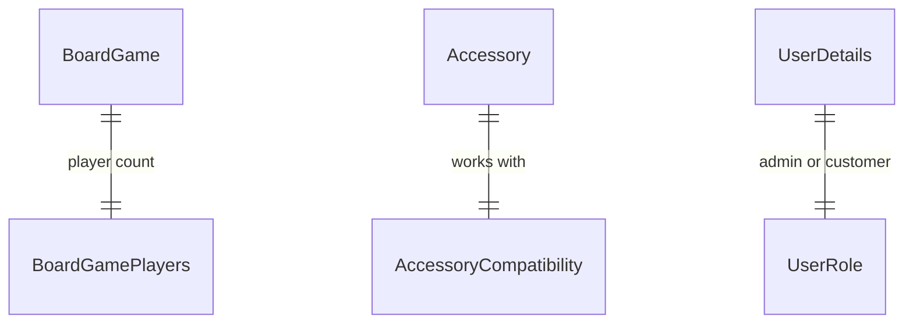

# Board Game Store

A desktop shop for board games and accessories. You log in as an **admin** or a **customer**,
and get a different set of screens depending on which.

Written in Java with a JavaFX interface. The data lives in SQLite, and every database query
is written in Python — Java calls into it through an embedded interpreter.

---

## What you can do

**As a customer**

| Screen | What it does |
|---|---|
| View Products | Browse everything in stock, search by product ID or compatibility, add to basket from the row |
| Pay | See your basket, remove lines, pick PayPal or card, and pay |
| Clear Basket | Empty the basket |

**As an admin**

| Screen | What it does |
|---|---|
| View All Products | The full stock list, including the purchase cost |
| Add New Product | Add a board game or an accessory |
| Rollback Database | Restore the last backup |

Customers never see the purchase cost. That is enforced in the SQL, not just hidden in the
interface — the customer queries do not select the `pcost` column at all.

> **Note:** picking a user is not a login. There are no passwords. This is coursework, not a
> real shop, and payment details are validated for shape only — nothing is ever charged.

---

## Running it

**The easy way.** Download a bundle for your platform from the
[Actions](../../actions) artifacts, unzip it, and run `Scripts/run.bat` (Windows) or
`Scripts/run.sh` (Linux/macOS). The bundle carries its own Python, so nothing needs installing.

**From source.** You need JDK 25 and Maven.

```bash
mvn clean package      # build
mvn test               # run the tests (51 of them)
```

Then run `gui.app.MainApp` from your IDE. There is also a command line version at
`CLIbasis.CLIbasis.Main` which does the same jobs in a text menu.

---

## How it fits together

Four layers. Each one only talks to the one below it.



The important part is that **the GUI and the CLI share everything below them**. A basket rule
or a payment check is written once and both interfaces get it. That is why the payment classes
take plain values instead of reading from the console — a `Scanner` would have locked them to
the text version.

### Java to Python

Java does not write SQL. It asks the Python module for what it wants, by name.



The script has to be copied to a real file first, because an embedded interpreter cannot run
a script that is still inside a jar. It sits next to the `data` folder, which is how the Python
finds `StoreData.db` on its own — purely from its own location.

Results come back as text. One row per line, fields split by `;`.

---

## The domain



A few decisions worth knowing:

- **The basket lives on the `Customer` object.** Screens pass that same object between
  themselves. Reloading the user from the database would hand back an empty basket.
- **`addShopping` returns a result, it does not print.** `ADDED`, `NOT_FOUND`,
  `INVALID_AMOUNT` or `INSUFFICIENT_STOCK` — so both interfaces can explain a failure in
  their own way.
- **Payment cannot fail.** There is no real gateway. Only the details are checked.

### Paying



If the stock update fails, the basket is **not** emptied. Better to make someone pay again
than to take their money and lose their order.

Every sale writes a receipt to `data/receipts/`, named for the time it happened, like
`2026-08-06_15-16-27.md`:

```markdown
# Receipt - 06/08/2026 15:16

| Product | Qty | Total |
|---------|-----|-------|
| Kingdoms of Valor | 1 | £45.00 |

£45.00 paid by Credit Card 101234 on 06/08/2026. Billing Address: 100 CV1 2GT Coventry
```

---

## Project layout

```
src/main/java/
  gui/app/            JavaFX entry point and screen controllers
  CLIbasis/           text menus
  Users/              User, Admin, Customer, newBasket
  Inventory/          Product, BoardGame, Accessory
  Payment/            payment methods and receipts
  Bridge/             the Java to Python link
src/main/resources/
  DatabaseManager.py  every SQL query in the project
  controllers/        FXML screen layouts and the stylesheet
src/test/java/        unit tests for the rules
data/StoreData.db     the database
packaging/            launcher scripts
```

## Database

SQLite. Six tables — products are split so that the parts unique to each kind live separately.



`Rollback Database` restores `data/backups/`, which is written before anything changes stock.

## Building the releases

A GitHub Actions workflow builds one bundle per platform. It cannot be a single download,
because the embedded interpreter is a native library — Windows, Linux and macOS each need
their own. Each bundle is smoke tested before it is published: the workflow starts the app
and checks it reaches the menu.

## Licence

Apache 2.0. See [LICENSE](LICENSE). Each release bundle ships the licences of the things it
carries — Python, JavaFX and JEP — in its own `licenses/` folder.
